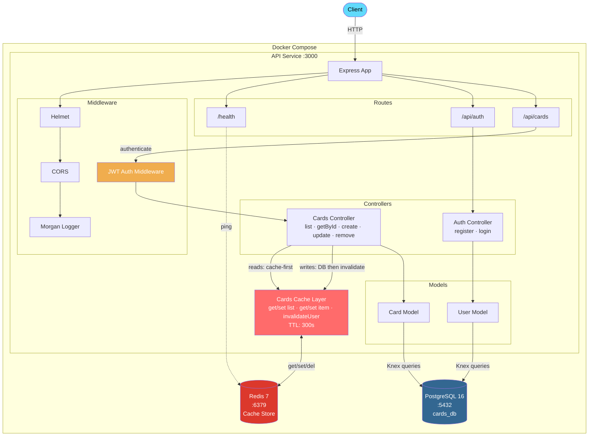
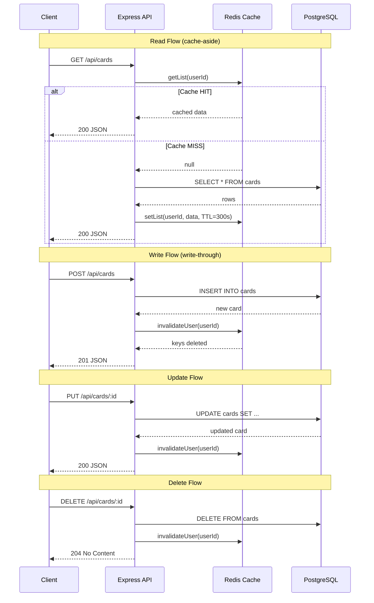
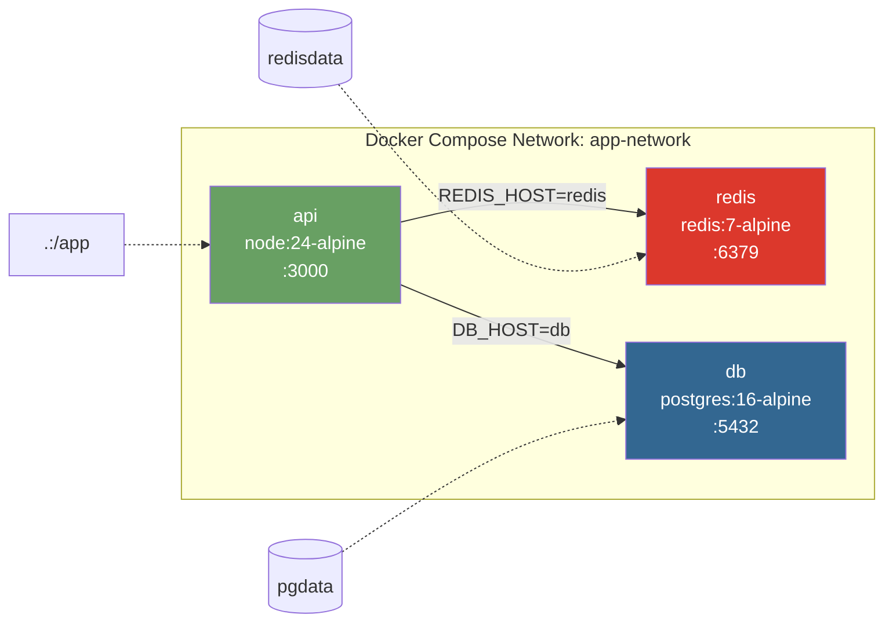

# System Architecture

```mermaid
graph TB
    Client([Client])

    subgraph Docker Compose
        subgraph api["API Service :3000"]
            direction TB
            Express[Express App]

            subgraph Middleware
                Helmet[Helmet]
                CORS[CORS]
                Morgan[Morgan Logger]
                Auth[JWT Auth Middleware]
            end

            subgraph Routes
                AuthRoutes["/api/auth"]
                CardsRoutes["/api/cards"]
                Health["/health"]
            end

            subgraph Controllers
                AuthCtrl["Auth Controller<br/>register · login"]
                CardsCtrl["Cards Controller<br/>list · getById · create · update · remove"]
            end

            subgraph Models
                UserModel[User Model]
                CardModel[Card Model]
            end

            Cache["Cards Cache Layer<br/>get/set list · get/set item · invalidateUser<br/>TTL: 300s"]
        end

        Redis[("Redis 7<br/>:6379<br/>Cache Store")]
        Postgres[("PostgreSQL 16<br/>:5432<br/>cards_db")]
    end

    Client -->|HTTP| Express
    Express --> Helmet --> CORS --> Morgan

    Express --> Health
    Express --> AuthRoutes
    Express --> CardsRoutes

    AuthRoutes --> AuthCtrl
    CardsRoutes -->|authenticate| Auth
    Auth --> CardsCtrl

    AuthCtrl --> UserModel
    CardsCtrl -->|reads: cache-first| Cache
    CardsCtrl -->|writes: DB then invalidate| Cache
    CardsCtrl --> CardModel

    Cache <-->|get/set/del| Redis
    UserModel -->|Knex queries| Postgres
    CardModel -->|Knex queries| Postgres

    Health -.->|ping| Redis

    style Redis fill:#dc382c,color:#fff
    style Postgres fill:#336791,color:#fff
    style Cache fill:#ff6b6b,color:#fff
    style Auth fill:#f0ad4e,color:#fff
    style Client fill:#61dafb,color:#000
```

## Data Flow

```mermaid
sequenceDiagram
    participant C as Client
    participant API as Express API
    participant Cache as Redis Cache
    participant DB as PostgreSQL

    Note over C,DB: Read Flow (cache-aside)
    C->>API: GET /api/cards
    API->>Cache: getList(userId)
    alt Cache HIT
        Cache-->>API: cached data
        API-->>C: 200 JSON
    else Cache MISS
        Cache-->>API: null
        API->>DB: SELECT * FROM cards
        DB-->>API: rows
        API->>Cache: setList(userId, data, TTL=300s)
        API-->>C: 200 JSON
    end

    Note over C,DB: Write Flow (write-through)
    C->>API: POST /api/cards
    API->>DB: INSERT INTO cards
    DB-->>API: new card
    API->>Cache: invalidateUser(userId)
    Cache-->>API: keys deleted
    API-->>C: 201 JSON

    Note over C,DB: Update Flow
    C->>API: PUT /api/cards/:id
    API->>DB: UPDATE cards SET ...
    DB-->>API: updated card
    API->>Cache: invalidateUser(userId)
    API-->>C: 200 JSON

    Note over C,DB: Delete Flow
    C->>API: DELETE /api/cards/:id
    API->>DB: DELETE FROM cards
    API->>Cache: invalidateUser(userId)
    API-->>C: 204 No Content
```

## Container Topology

```mermaid
graph LR
    subgraph docker-compose["Docker Compose Network: app-network"]
        API["api<br/>node:24-alpine<br/>:3000"]
        Redis["redis<br/>redis:7-alpine<br/>:6379"]
        DB["db<br/>postgres:16-alpine<br/>:5432"]
    end

    API -->|REDIS_HOST=redis| Redis
    API -->|DB_HOST=db| DB

    PG_VOL[(pgdata)] -.-> DB
    REDIS_VOL[(redisdata)] -.-> Redis
    SRC_VOL[".:/app"] -.-> API

    style API fill:#68a063,color:#fff
    style Redis fill:#dc382c,color:#fff
    style DB fill:#336791,color:#fff
```
