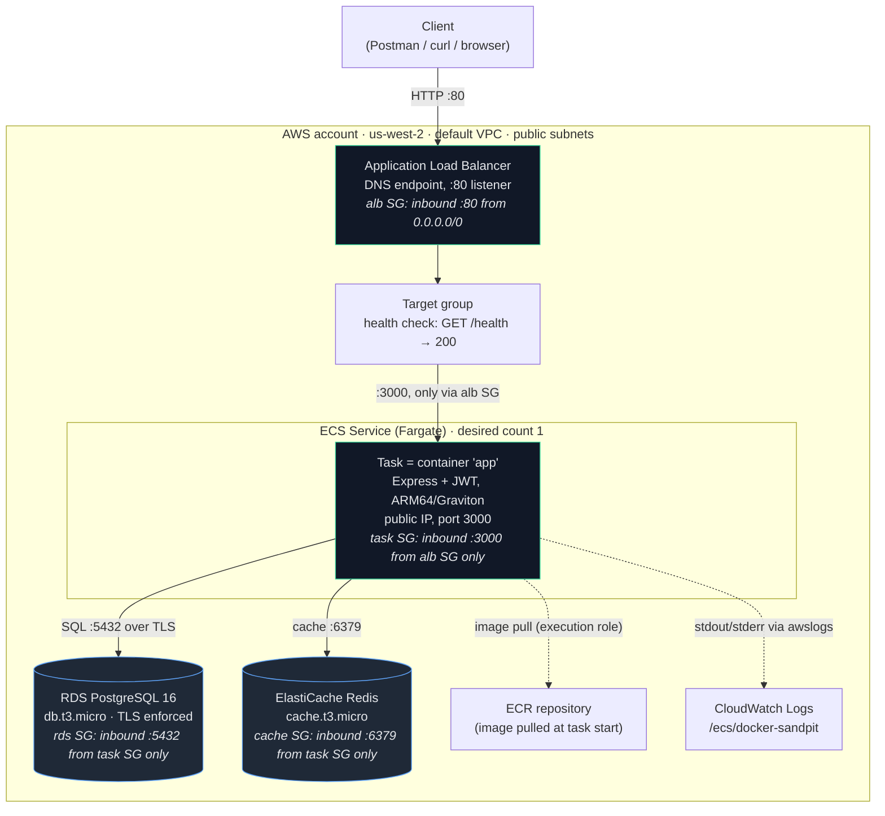
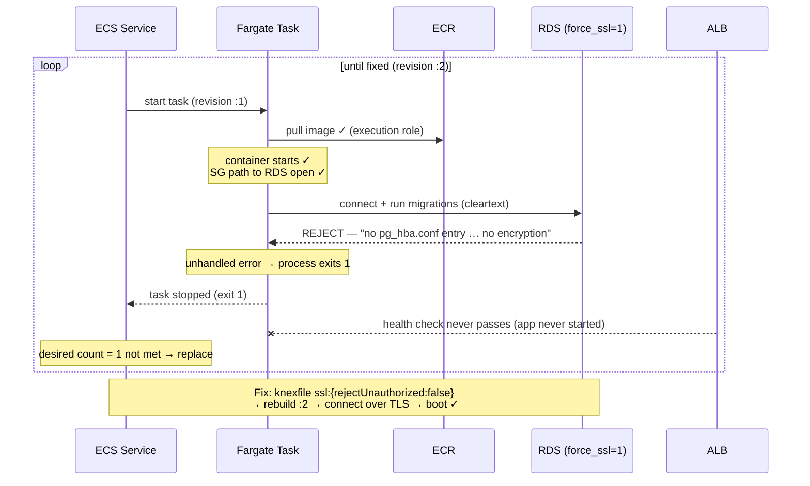
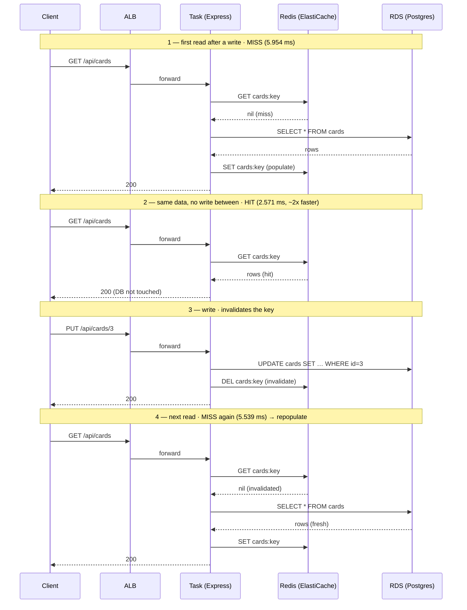

# docker-sandpit — AWS Fargate Deployment Notes

A reference for re-reading: the terminology stated precisely, and the reasoning behind each
choice kept next to it. Written after a bounded same-day exercise — deploy the local
Compose stack to AWS-native primitives, verify end-to-end, tear everything down. The point
was never "have a running app"; it was to map concepts I already know (Docker / Compose)
onto the AWS layer and get the words right.

The stack was destroyed to zero after testing. IDs below are illustrative — the resources
no longer exist.

---

## 1. What was built, as a mapping

The whole exercise is one translation: a `docker-compose.yml` stack into managed AWS
services. Read this table first; everything else is detail underneath it.

| Local (Compose) | AWS | What carried over |
|---|---|---|
| `api` service (Express + JWT) | ECR image → task definition → ECS service on **Fargate** | the container itself, unchanged |
| `postgres` service | **RDS** PostgreSQL (managed; no container) | the database engine |
| `redis` service | **ElastiCache** Redis (managed) | the cache |
| default Compose network; reach peers by service name | **VPC + security groups**; reach peers by endpoint **DNS** | service-to-service reachability |
| `ports:` | container port → **target group** → **ALB** listener | the public entry point |
| `environment:` / `env_file:` | task-definition env vars / `secrets` | runtime config |
| `depends_on` | *nothing* — handle with connection retry | (ECS does not order cross-service startup) |
| `docker compose up` / `down` | `terraform apply` / `destroy` | the lifecycle verb |

The one structural change from local: `docker compose up` does build+run in one step;
on AWS it splits into **provision infra** (Terraform) and **ship image** (a manual
`docker build`→`push` to ECR), because Terraform references an image that must already
exist — it cannot build one.

Stack shape: ECS Fargate (the API) behind an **ALB**, with **RDS** and **ElastiCache**
as the data stores, all in **public subnets with no NAT gateway**, defined as Terraform
in a single root module with **local state**.

### Diagram 1 — High-level architecture and request path

Read the security-group boundaries as the firewalls: a request can only cross an arrow
because an SG explicitly allows it. The internet reaches *only* the ALB; everything behind
it admits traffic from the tier in front of it, by SG reference (§5).



Solid arrows are the live request path; dashed arrows are platform plumbing (image pull,
log shipping). The database has **no inbound arrow from the internet** — that's the sealed
posture, not an omission.

---

## 2. Terminology corrections (the part most worth re-reading)

These are the places where the intuitive guess is wrong. Getting them precise is the
whole reason this doc exists.

### A task is a Pod, not an EC2 instance

The tempting analogy is "a task ≈ an EC2 instance." It's right as a *network endpoint*
(a task has its own ENI, private IP, and security group, like an instance) but wrong as
an *abstraction*.

- An **EC2 instance** is a virtual machine — a full OS you own, boot, patch, SSH into.
- A **task** is a *grouping of one or more containers scheduled together*, run on compute
  AWS owns and you never see. With Fargate there is **no VM in your account** — which is
  exactly why the EC2 → Instances console was empty while the app was live.

The accurate cross-platform map:

| Kubernetes | ECS | Meaning |
|---|---|---|
| **Pod** | **Task** | co-scheduled containers sharing a network namespace |
| **Deployment** | **Service** | keeps N copies running; replaces dead ones |
| **Node** | EC2 instance / Fargate's hidden host | the machine underneath |

A task is the **Pod**, not the Node. "I'd `kubectl get pods` then exec in" maps to
`aws ecs list-tasks` then `aws ecs execute-command` — because the task *is* the pod-level
unit you shell into.

Consequence that explains the whole networking model: a task is **cattle, not a pet.**
ECS kills and replaces it freely, and each replacement gets a **new IP**. (Watched this
directly during the crash loop — tasks dying and being replaced, each a fresh one, not a
rebooted same-one.) That's *why* the RDS rule referenced the task's **security group**,
not its IP: the IP is ephemeral by design; SG membership is stable.

### Task definition vs Service: contents vs placement

These are two layers and the boundary between them matters.

- **Task definition** = what runs *inside* the unit: container image(s), CPU/memory,
  port mappings, env vars and secrets, log driver, and the two IAM roles. The immutable
  recipe. It knows nothing about where it will run.
- **Service** = how the unit is *placed in the world*: desired count, which **subnets**,
  which **security groups**, public IP or not, and ALB target-group registration.

The security group is set on the **service's** `network_configuration`, **not** the task
definition. This is good design, not an annoyance: the same task definition can deploy
into public subnets behind an ALB or private subnets with no public IP, byte-for-byte
identical — only the service's placement differs. Networking is a *placement* concern, not
a *contents* concern. (Docker intuition: the image + run-config is one thing; the
`--network` you attach at `run` time is a separate decision.)

In k8s terms: task def ≈ the Pod spec's container section; service ≈ the Deployment plus
its networking.

Task definitions are **versioned and immutable** — `docker-sandpit:1` was the first
revision, `:2` the rebuild with the SSL fix. A running task is an *instantiation* of a
specific revision.

### The two IAM roles on a task (don't conflate them)

- **Execution role** — used by the Fargate platform itself to *pull the image from ECR*
  and *write logs to CloudWatch*. "Permissions the runtime needs to start your container."
  If you inject secrets via the task def's `secrets` block, it's the **execution** role
  that fetches them at container-start — a common point of confusion.
- **Task role** — used by *your application code* at runtime if it calls AWS APIs (S3,
  etc.). For this app it was minimal/empty: the app talks to Postgres/Redis over the
  network, not via the AWS SDK.

### Security group = a stateful, allow-only firewall on a network interface

Not a property of a service — a standalone object you *attach* to whatever has an ENI
(a task, the ALB, an RDS instance). Key properties:

- **Allow-only.** There are no deny rules; anything not explicitly allowed is denied.
- **Stateful.** You write only the *inbound* rule; return traffic is automatically
  permitted. (That's why the verified rules showed only inbound and the stack still
  worked end-to-end — never had to write "rds may reply to task.")
- **Source can be a CIDR or another SG.** Using an SG as the source is the idiom that
  replaces Compose's name-based reachability — it resolves *dynamically* by membership, so
  a replaced task with a new IP still matches the rule as long as it wears the same SG.

(Network ACLs are the subnet-level firewall — stateless, with explicit deny. Left at
defaults here; correct scope.)

### CIDR

**Classless Inter-Domain Routing** — a notation for an IP *range*, written
`<base>/<prefix length>`. The number after the slash is how many leading bits are fixed;
the rest vary. Smaller number = bigger block.

- `0.0.0.0/0` — zero bits fixed → **every IPv4 address** = "the whole internet."
- `/32` — all bits fixed → exactly one address.
- `10.0.0.0/16` — 65,536 addresses.

In SG terms a CIDR source answers "which raw IP range may reach this port." Only the
front door (the ALB) should carry `0.0.0.0/0`.

### Cache-aside with write-through invalidation

The app's caching pattern, demonstrated live (see §7):

- **Read:** check Redis; on **miss**, read RDS, then populate Redis; on **hit**, skip RDS.
- **Write:** write RDS, then **invalidate** the cache key so the next read misses and
  re-populates with fresh data.

---

## 3. Credentials and IAM

### Identity Center vs a scoped IAM user — and why the "best practice" didn't apply

AWS's stated best practice is IAM Identity Center (temporary, auto-expiring credentials;
no standing keys). But its wins — centralized multi-account access, IdP integration — are
*scale* properties that don't apply to a one-account, one-day exercise. The only property
that transfers is auto-expiry, and even that protects only against a *leaked credential*;
it does nothing about *orphaned resources* (RDS keeps billing regardless of whether the
CLI token expired). So for this exercise the security delta was small, and the deciding
factor was friction.

**Choice:** a dedicated scoped IAM user (`docker-sandpit-tf`), CLI-only (no console
access), deleted at teardown.
**Why:** on a legacy account where Identity Center isn't already enabled, standing it up
is more clicks than a scoped user, and the user's one liability (a long-lived key) was
already on the teardown checklist.
**Adopt Identity Center** when this becomes recurring or touches >1 account.

Signing into the *console* as root to create this user is legitimate — what you avoid is
creating root *access keys* and using them programmatically. Different things.

### The permission set: scoped, not skeletal

Counterintuitive but important: **a too-tight IAM policy is bad for teardown.** If
`apply` hits a permission denial halfway, you get a half-built stack — orphaned resources
that complicate `destroy`. The goal is "not admin," not "minimal."

**Choice:** `PowerUserAccess` (all services *except* IAM/Organizations/account management)
**+** a small inline policy for the IAM role actions Terraform needs:

```json
{
  "Sid": "TaskRoleLifecycle",
  "Effect": "Allow",
  "Action": [
    "iam:CreateRole", "iam:DeleteRole", "iam:GetRole", "iam:PassRole",
    "iam:AttachRolePolicy", "iam:DetachRolePolicy",
    "iam:PutRolePolicy", "iam:DeleteRolePolicy",
    "iam:ListRolePolicies", "iam:ListAttachedRolePolicies",
    "iam:TagRole", "iam:UntagRole"
  ],
  "Resource": "arn:aws:iam::<ACCOUNT_ID>:role/docker-sandpit-*"
}
```

Plus a separate statement for `iam:CreateServiceLinkedRole` on `Resource: "*"` (service-
linked roles have AWS-controlled names that can't be prefix-matched).

- `PowerUserAccess` structurally blocks the thing to worry about (creating IAM users,
  touching billing/org), while covering ecs/ecr/rds/elasticache/ec2/elb/logs.
- The inline supplement exists because PowerUserAccess *excludes* IAM, but Fargate task
  roles can't be created without `CreateRole` + `PassRole`.
- Scoping `Resource` to the `docker-sandpit-*` name prefix contains it tightly — which
  means task roles **must** be named with that prefix or `apply` fails.

### The IAM teardown lesson (the sharpest one)

`terraform destroy` removed 19 of 21 resources, then **tripped on the two IAM roles.**
Cause: the policy granted role *creation* under the prefix but lacked
**`iam:ListInstanceProfilesForRole`**, which the AWS provider calls as a *pre-delete read*.
Resolved manually with `aws iam delete-role` (which doesn't make that list call) +
removing them from state.

This is the least-privilege-vs-clean-teardown tension made concrete, and it shows up at
**destroy** time — the worst time to discover it. The fix for next time: add
`iam:ListInstanceProfilesForRole` (scoped to the prefix) to the user's policy. General
principle: **a scoped Terraform policy needs the read/list actions on the *delete* path,
not just create.**

---

## 4. The ECR → task definition → Fargate chain

1. **ECR repository** — the image registry (replaces Docker Hub / local image store).
   Created empty by Terraform. (`force_delete = true` so `destroy` doesn't choke on a
   repo that still holds an image.)
2. **Push** — local: `docker build` (native **arm64** → Fargate `runtime_platform = ARM64`
   / Graviton, faster than emulated amd64 cross-build), tag with the ECR URI,
   `aws ecr get-login-password | docker login`, `docker push`. The one step outside
   Terraform's desired-state model — the image must exist in ECR before the service can
   place a task.
3. **Task definition** — the recipe (§2): image, CPU/mem, ports, env/secrets, log driver,
   the two roles.
4. **ECS Service** — references the task def, holds desired count, registers with the ALB
   target group, places tasks in subnets with a security group. Replaces
   `restart: always` + the supervisor that keeps it running.
5. **Fargate** — the launch type: no EC2 hosts to manage; declare CPU/mem, AWS runs it.

---

## 5. Networking

### The security-group chain (verified by reference)

Each tier's inbound rule names the *previous* tier's SG as source — never a CIDR except
the front door. This is the by-reference idiom, confirmed from the live config:

```
internet ──0.0.0.0/0:80──▶ [alb SG]
[alb SG] ──:3000──▶ [task SG]
[task SG] ──:5432──▶ [rds SG]
[task SG] ──:6379──▶ [cache SG]
```

Only the **alb** SG had a CIDR (`0.0.0.0/0` on 80). task/rds/cache used **`FromSG`**
(another security group as source), no CIDR. Reading it by ID was airtight:
internet → alb → task → {rds, cache}.

Why this matters beyond aesthetics: it's the **least-privilege network posture.** Each
tier talks only to the tier above it; a compromised task's blast radius is bounded to
RDS+Redis, not the whole VPC; the database has **no internet path at all.** This is also
why the only window into the DB during a request trace is the app's own logs — the DB is
genuinely unreachable from anything that isn't the task.

### Public subnets, no NAT gateway

**Choice:** Fargate tasks in public subnets with `assign_public_ip = true`; no NAT.
**Why:** tasks reach ECR and CloudWatch directly via the internet gateway, skipping the
~$32/mo NAT gateway *and* its Elastic IP (a classic orphan-cost). Used the **default VPC
as a data source** rather than creating one — smallest teardown surface, and it sidesteps
the "VPC won't delete because of a lingering ENI" failure entirely (the VPC isn't yours
to destroy).
**Trade-off:** tasks have public IPs at the network layer — but the task SG only admits
the ALB SG, so nothing is actually reachable except through the load balancer. Acceptable
for a bounded exercise; the "real" hardening (private subnets) costs NAT or VPC-endpoint
charges that don't earn their keep in an hour.

### Why use DNS, not an IP, for the ALB

An ALB isn't one machine — it's a managed, AZ-spanning thing whose underlying IPs change
as AWS scales it. So you get a stable **DNS name** that resolves to whatever IPs are
current. You curl the name (`http://docker-sandpit-XXXX.us-west-2.elb.amazonaws.com`),
never an IP.

---

## 6. The `force_ssl` failure (the best lesson in the run)

**Symptom:** every task booted, ran migrations, crashed on the first DB call, exited 1,
and ECS replaced it — a **crash loop**. The ALB target never went healthy.

**Log line:** `no pg_hba.conf entry for host "172.31.0.90", user "cards_user",
database "cards_db", no encryption`

**Diagnosis:** RDS Postgres 16's default parameter group ships with `rds.force_ssl = 1`,
which **refuses unencrypted connections.** Local Postgres doesn't set that, so the app's
`knexfile.js` production connection had no SSL config — it worked locally and failed only
in RDS. The container *reached* RDS (so SGs, image, IAM, networking all worked); RDS
rejected it for being cleartext.

**The transferable insight — rejection vs timeout:** a *rejection* means the packet
arrived (so the SG path was open); a *timeout* would mean the firewall ate it. The error
being a rejection was actually positive evidence the networking was correct. **This is a
managed service enforcing a security default the local container didn't have** — the
general category of surprise to expect when moving Compose → managed AWS.

### Diagram 2 — The crash loop (and where it broke)

Everything up to the DB write succeeded; the single missing line of TLS config turned the
first query into a fatal exit, and ECS's job of "keep desired count running" turned that
into an infinite replace loop. Note *which* hops passed — that's how you localize the fault
to the app's DB config rather than the network.



The diagnostic reading order: image pull ✓, container start ✓, SG path ✓ (a *rejection*
proves the packet arrived) — so the fault is app-layer, not infra. That chain of
eliminations is the actual skill the failure taught.

**Fix (chosen):** add `ssl: { rejectUnauthorized: false }` to the knexfile production
connection, rebuild, push `:2`, rolling deploy. RDS stays encrypted (`force_ssl=1`).
**Why this over disabling `force_ssl`:** it's the production-honest fix (app speaks TLS),
keeps the DB encrypted, adds nothing to teardown, and the rebuild→push→apply loop is worth
the reps. Disabling `force_ssl` would weaken the DB and add a parameter group to tear down.
**Shortcut noted:** `rejectUnauthorized: false` skips *verifying* the RDS cert. Fine for
throwaway; the fully-correct version points at the RDS CA bundle. Deliberate shortcut, not
to be carried into real deployments.

---

## 7. Cache-aside, demonstrated in the logs

The miss→hit→invalidate→miss pattern, visible in real CloudWatch timings (sealed DB means
latency *is* the evidence — there's no other window into the cache behavior):

```
GET /api/cards 200  5.954 ms   ← first read after a write: cache MISS → RDS, repopulates
GET /api/cards 200  2.571 ms   ← same data, no write between: cache HIT → Redis (~2x faster)
PUT /api/cards/3 200           ← write invalidates the cache key
GET /api/cards 200  5.539 ms   ← next read MISSES again → back to RDS
```

The ~2x latency gap between hit and miss, and the fact that every write forces the next
read back to the database, *is* the cache-aside-with-write-through-invalidation design,
proven on real infra rather than asserted.

### Diagram 3 — Cache-aside, the miss → hit → invalidate → miss cycle

The same four requests as the trace above, showing *which* backend each one touches and
why the latency moves. The cache key's lifecycle is the spine: populated on a miss,
served on a hit, deleted on a write.



Because the DB is sealed behind the SG chain, you can't watch the DB hop directly — the
**latency itself is the evidence**: single-digit ms when it touches RDS, ~2.5 ms when
Redis answers alone. That's the lesson worth remembering — in a sealed-DB design,
response time is your window into the cache.

Other things the log made concrete:
- Each line's `app/app/ba431...` prefix is the **log stream**: `<container>/<container>/
  <task-id>`. One stream because one task; three tasks would interleave three streams.
- The steady sub-millisecond `GET /health 200` every ~30s is the **ALB health check**
  polling. It hits `/health` (shallow), not `/health/deep` (Redis-aware) — confirming the
  health-check split (see §8). If those ever start failing, that's the kill/replace loop
  returning.

---

## 8. Observability — and where it's uneven

- **App logs:** the `awslogs` log driver ships stdout/stderr to **CloudWatch Logs**
  (`/ecs/docker-sandpit`). The `docker compose logs` equivalent. The log group was created
  **explicitly in Terraform** — if you let the awslogs driver auto-create it, it isn't in
  state and `destroy` leaves it orphaned.
- **Metrics:** the ALB emits request count / target health / 5xx to CloudWatch
  automatically; RDS and ElastiCache emit their own.
- **ALB access logs were deliberately OFF.** They require an S3 bucket + config — scope
  creep and extra teardown surface for a one-hour run. So the ALB *hop* is visible only in
  CloudWatch *metrics*, not request-level logs.

The honest takeaway: **observability is uneven across the stack, and the gaps are where
you didn't instrument.** ALB hop → metrics only; task/DB/cache hops → CloudWatch Logs;
DB hop → app-side only (sealed by SG). "I should turn on X-Ray to really see the trace"
is a *next-build* note, not a thing to bolt onto a throwaway.

### Health-check split (the fix that prevented the kill/replace loop)

The app's original `/health` awaited `redis.ping()` — a *dependency* check that can hang
during boot before Redis connects, which fails ALB health checks and triggers the loop.
Split into:
- `/health` — shallow, 200-only, process-liveness. **What the ALB probes.**
- `/health/deep` — Redis-aware. For manual checks, not the ALB.

Plus a generous `health_check_grace_period_seconds` (180s) so the migrate-then-boot
sequence finishes before the first probe counts against the task. **Couple "is the web
server alive" to "is the whole stack wired" and you'll chase the wrong failure.**

---

## 9. Teardown completeness

The reliable guarantee isn't ordering — it's three things: one Terraform **state** so a
single `destroy` covers everything; **destroy-blocking flags set at creation**; and a
**post-destroy sweep** for known orphan classes.

Flags set at creation (they default *against* you):
- **RDS:** `skip_final_snapshot = true`, `deletion_protection = false`.
- **ElastiCache:** final snapshot disabled.
- **ECR:** `force_delete = true`.
- **CloudWatch log group:** defined in Terraform.

The sweep (filter by the `project = docker-sandpit` tag from `default_tags`):
- RDS / ElastiCache snapshots → none.
- Log group → gone.
- Stray ENIs in the VPC → none (most likely cause of a VPC-deletion hang; avoided here by
  using the default VPC).
- INACTIVE task definitions (`:1`, `:2`) lingering is **normal** — they cost nothing and
  aren't a teardown failure.

Outside Terraform's graph — **manual** teardown steps:
- Delete the `docker-sandpit-tf` IAM user + access key. (The one long-lived credential.)
- Delete the local `terraform/` directory — `terraform.tfstate` holds the DB password and
  JWT secret **in plaintext**.

Backstop: the budget alarm.

### The secrets-hygiene lesson

- **`.tf` files are config and safe to commit; `.tfstate` is secrets and never goes to
  git.** In this stack the secrets came from `random_password` (generated into *state*, not
  source), so the `.tf` files were clean — but the state file was not.
- `.gitignore` must use **patterns**, not one-off folder names:
  `*.tfstate`, `*.tfstate.*` (catches `.backup`), `.terraform/`, plus `.env`.
- Verify with `git check-ignore terraform/terraform.tfstate` — authoritative, unlike the
  editor's file coloring.
- Reflex worth keeping: **scan any log file for `eyJ` (JWT prefix) and `password` before
  `git add`.**

---

## 10. Production-hardening notes (next-level, not done here)

Captured because the questions came up; explicitly *not* built for a throwaway.

- **Direct data access in prod is break-glass, not open-door.** The instinct "easy
  `exec` into any pod and query the DB" is an anti-pattern at scale: a shell in a prod pod
  is unaudited live write access to customer data. Mature setups make it *possible but
  expensive and recorded* — time-boxed elevated access (Teleport / SSM Session Manager /
  an access broker), every command logged, sometimes a second approver.
- **Routine ops become tools, not shells.** "Invalidate cache for user X" should be an
  endpoint/admin command that goes through the app's own code path (respects invalidation
  logic, gets logged, can't typo `FLUSHALL`). Read access is usually a **read replica** you
  point a query tool at — look without a path to mutate the primary.
- **Connection is via a controlled entry point** — bastion / SSM port-forward — not by
  opening the DB's security group to your laptop's IP.
- **To inspect this stack's DB/Redis directly next time:** redeploy with
  `enable_execute_command = true` on the service + SSM permissions on the task role, then
  `aws ecs execute-command` *into* the task and run `psql` / `redis-cli` from inside the
  boundary. That's break-glass *through* the boundary — the deliberate version of the
  access the exercise (correctly) didn't have.

Connecting thread: the sealed database I couldn't reach from my laptop **is the production
posture.** Prod doesn't knock the wall down — it adds a logged door.

---

## Glossary (quick terminology check)

| Term | One-line definition |
|---|---|
| **Fargate** | Serverless launch type for ECS — runs containers on AWS-managed compute; no EC2 host in your account. |
| **Task** | A running unit of one or more co-scheduled containers (≈ a k8s Pod). Ephemeral; replaced freely. |
| **Task definition** | The immutable, versioned recipe for a task's *contents* (image, CPU/mem, env, roles, logging). |
| **ECS Service** | Keeps N tasks running and defines their *placement* (subnets, security groups, ALB registration). |
| **Execution role** | IAM role the Fargate platform uses to pull the image and write logs (and fetch task-def `secrets`). |
| **Task role** | IAM role the app code uses for its own runtime AWS API calls. |
| **ECR** | Elastic Container Registry — the image registry (≈ Docker Hub). |
| **ALB** | Application Load Balancer — the managed, DNS-addressed public entry point; routes to healthy targets. |
| **Target group** | The set of task targets the ALB routes to, with a health check. |
| **Security group** | A stateful, allow-only firewall attached to an ENI; source can be a CIDR or another SG. |
| **CIDR** | `base/prefix` notation for an IP range; `0.0.0.0/0` = the whole internet. |
| **RDS** | Managed relational database (Postgres here). |
| **ElastiCache** | Managed Redis/Memcached. |
| **NAT gateway** | Lets private-subnet resources reach the internet outbound; ~$32/mo + an EIP. Avoided here. |
| **Cache-aside** | App checks cache first; on miss reads DB and populates cache; writes invalidate the key. |
| **`rds.force_ssl`** | RDS Postgres parameter; `1` (default on PG16) refuses unencrypted DB connections. |
| **`terraform.tfstate`** | Terraform's record of real resources — contains generated secrets in plaintext. Never commit. |
| **Data source** | A Terraform *lookup* of something that already exists (e.g. the default VPC) — not created, not destroyed. |
| **Rejection vs timeout** | DB rejection = packet arrived (SG open, app-layer refusal); timeout = SG blocked it. Different fixes. |